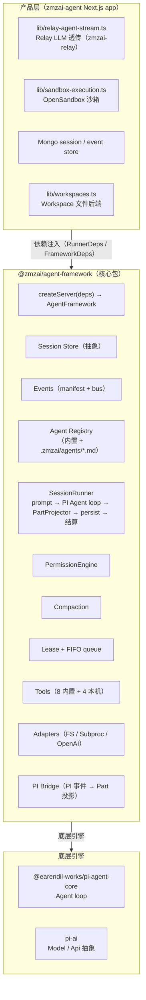
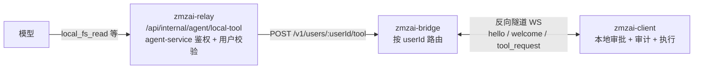
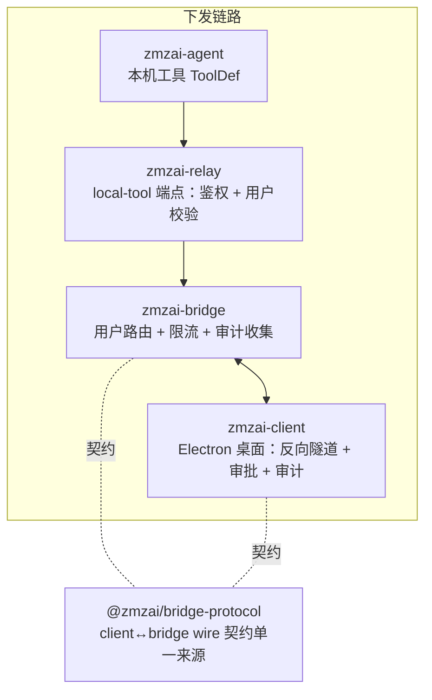

# zmzai-agent 技术方案：一个 PI 驱动的云端多租户 Coding Agent 框架

> 日期：2026-08-14
> 范围：`zmzai-agent/packages/agent-framework`（核心框架包）+ `zmzai-agent/lib`（产品接入层）
> 定位：本文是 zmzai-agent 当前架构的完整技术说明，可作为课程/博客素材。所有设计决策均标注了真实源码位置。
> 更新：2026-08-25 —— 新增 §6.6 本机工具（local tools）与执行边界说明；对应 client/bridge/protocol/relay 的打通（见 §10.3）。

---

## 1. 一句话定位

zmzai-agent 是一个 **存储/后端无关的 Agent 编排框架**：核心包 `@zmzai/agent-framework` 只定义「会话、权限、工具、运行循环、事件」的抽象，所有产品面（模型、沙箱、文件后端、事件日志、计费）通过依赖注入接入。云产品（`zmzai-agent` Next.js 应用）注入 MongoDB + Relay LLM + OpenSandbox；CLI 用 JSONL + OpenAI provider + 子进程沙箱 + 本地 FS——**同一套核心，两种部署形态**。

它和「一个 agent loop 脚本」的本质区别在于：核心包不假设你用什么模型、存哪里、在哪跑命令。这是它能在云（多租户、Mongo、隔离沙箱）和本地（单机、JSONL、子进程）之间复用的前提。

---

## 2. 整体架构



### 分层职责

| 层 | 职责 | 关键文件 |
|---|---|---|
| **产品层** | 把 Mongo/Relay/沙箱接到框架抽象上 | `lib/relay-agent-stream.ts`、`lib/sandbox-execution.ts` |
| **核心包** | 会话/权限/工具/循环/事件，**零产品依赖** | `packages/agent-framework/src/core/*` |
| **PI 引擎** | 真正的 LLM 循环（ReAct）、工具调度、流式 | `@earendil-works/pi-agent-core` |

核心包**只依赖 PI 的类型**，不依赖任何具体模型/存储。这是整个架构的可复用性根基。

---

## 3. 核心数据模型

框架定义了一套**冻结的 v0 wire format**（`core/session/types.ts`），所有客户端（Web workbench、未来 TUI、SDK）都从它渲染。

### 3.1 Session / Message / Part 三级结构

```
Session（会话）
 ├─ 绑定 workspaceId（创建时不可变）+ userId
 ├─ agent: 当前主代理预设名
 ├─ model: { providerId, modelId }
 ├─ permission: Ruleset（会话级规则，"always" 批准落这里）
 ├─ parentId?: 父会话（子代理 spawn 时设）
 └─ queuedPrompts: FIFO（运行中提交的 prompt 排队）

Message（消息：user / assistant）
 └─ Part[]（一个消息的多个组成块）

Part 类型（联合类型，8 种）：
 ├─ text          普通文本
 ├─ reasoning     模型思考链（R1 类）
 ├─ tool          工具调用（含 state: pending→running→completed/error）
 ├─ step-start / step-finish   一轮 LLM 的边界（带 token 用量）
 ├─ subtask       子代理调用（链向 childSessionId）
 ├─ file          文件附件
 └─ compaction    上下文压缩摘要（边界标记）
```

**设计要点**：Part 是**最小可流式单元**。模型的流式输出被拆成 text/reasoning/tool 多个 Part，UI 可以分别渲染（比如 reasoning 折叠、tool 卡片实时刷新）。`ToolState` 是一个状态机：`pending → running → completed | error`，每次状态变更是独立的 `message.part.updated` 事件。

### 3.2 为什么不是「一条 assistant message = 一段 text」

因为真实 agent 的一轮回复是**多模态混合**的：模型可能先输出一段思考（reasoning），再决定调工具（tool part），工具执行完再继续输出文本。如果用单一 text 字段，流式渲染、工具卡片、思考折叠都做不了。Part 模型让每个语义块独立可追踪、可流式、可持久化。

---

## 4. 运行循环（SessionRunner）

`SessionRunner`（`core/runtime/runner.ts`，593 行）是整个框架的心脏——**它拥有一个会话的完整生命周期**。

### 4.1 一次 prompt 的完整流程

```
runner.prompt(sessionId, { text })
  │
  ├─ 会话正在跑？ → 入 FIFO 队列，返回 { queued: true }
  │
  └─ runLoop(session, input)
       │
       ├─ 1. 解析 agent（registry + workspace 自定义 + 版本快照）
       ├─ 2. 构建 PermissionEngine（ruleset 栈：builtin → agent → session）
       ├─ 3. 构建 PI Agent：
       │     systemPrompt / model / tools / messages
       │     streamFn = relayStreamFn
       │     toolExecution = "sequential"
       │     transformContext = compactionTransform（可选）
       │     shouldStopAfterTurn = steps 上限（默认 12）
       │
       ├─ 4. 注册 PI 钩子：
       │     beforeToolCall → 权限闸口（ask/allow/deny）
       │     subscribe → PI 事件投到 PartProjector
       │
       ├─ 5. agent.prompt(text)
       │     └─ PI 内部 ReAct 循环：LLM → (权限检查) → 工具 → LLM → ...
       │
       ├─ 6. 失败处理（F6）：
       │     isRetryableError(terminated/econnreset/...)?
       │     → 注入合成 user 消息 → agent.continue() 重试一次
       │
       ├─ 7. settled()：等所有异步持久化完成
       ├─ 8. stampLease / clearLease
       │
       └─ 9. FIFO：取下一个排队 prompt → 递归 runLoop
```

### 4.2 关键设计：PI 事件 → Part 投影（PartProjector）

PI 引擎发出的是它自己的事件流（`message_start` / `text_delta` / `tool_execution_end` ...），和框架的 Part 模型不一样。`PartProjector`（`core/runtime/pi-bridge.ts`）是纯函数式的**投影器**：把 PI 事件逐个 fold 成框架的 Message/Part 图 + 要发布的框架事件。

```
PI 事件                    PartProjector               框架事件
─────────                 ────────────                ─────────
message_start(assistant) → 新建 assistant message    → message.updated
text_delta("Hello")     → 累积到 text part buffer   → message.part.delta（流式）
tool_execution_start    → 新建 tool part(running)   → message.part.updated
tool_execution_end      → 更新 tool part(completed) → message.part.updated
message_end             → 关闭 message + step-finish→ message.updated
```

**两个工程细节**：
- **文本缓冲 flush**：delta 不逐字符发，攒到 2KB 才 flush 一次（`pi-bridge.ts:152`），避免事件风暴。
- **serializeEmit**：PI 的 subscribe 是同步回调，但持久化是异步。`serializeEmit`（`pi-bridge.ts:28`）用一个 promise chain 保证**事件顺序不乱**——即使持久化慢，UI 看到的顺序和发生顺序一致。

### 4.3 串行工具执行 & 为什么

`runner.ts:310` 显式设 `toolExecution: "sequential"`。PI 默认其实是 `"parallel"`。选串行的原因是**权限闸口 + 沙箱 snapshot 一致性**：并行工具如果同时触发多个权限询问，UI 会弹出多张审批卡；同时写操作并发会让沙箱 snapshot 产生竞态。代价是只读工具（read/glob/grep）也串行，损失一些并发——这是已知的取舍，未来可针对纯读工具放开（PI 支持 per-tool `executionMode`）。

---

## 5. 权限系统

权限是 agent 安全的命门。zmzai 的设计是**单一闸口 + 分层 ruleset + 三态回复**。

### 5.1 Ruleset DSL（`core/permission/ruleset.ts`）

```
Rule = { permission: string, pattern: string, action: "allow" | "deny" | "ask" }
```

- **permission 键**：`read / edit / bash / glob / grep / list / webfetch / task / todo / external_directory`（工具可扩展新键）
- **pattern**：glob 通配（`*` 匹配任意序列含路径分隔符，`?` 匹配单字符）
- **求值规则**：多个 ruleset 按顺序叠加，**最后匹配的规则胜出**，无匹配默认 `"ask"`

配置语法（镜像 opencode.json）：
```jsonc
{
  "bash": "ask",                 // 整个 permission 一个 action
  "read": { "*": "allow", "*.env": "ask" },  // 按 pattern 细分
  "edit": "allow"
}
```

### 5.2 三层 ruleset 栈

```
builtinDefaults（基线，所有 agent 之下）
   ├─ "*": "allow"                       // 默认放行
   ├─ external_directory: "*": "ask"     // 访问外部目录必问
   ├─ read: "*.env" → ask                // env 文件必问
   └─ bash: "ask"                        // 命令默认必问
        ↓ 叠加
agent preset（agent 自带的 permission）
        ↓ 叠加
session rules（用户 "always" 批准落这里）
```

### 5.3 PermissionEngine（`core/permission/engine.ts`）

**单一闸口**：`SessionRunner` 把 `engine.ask()` 接到 PI 的 `beforeToolCall`——每个工具调用在 `execute()` 之前必过这一关。

```
ask(permission, patterns)
  ├─ 已 allow（ruleset 命中）→ 直接放行
  ├─ 已 once 批准过同模式 → 放行（F1：本 run 不重复问）
  ├─ 否则 → 发 permission.asked 事件 → 挂起在 Promise 上等回复
  │
  reply(requestId, "once" | "always" | "reject")
  ├─ once   → 本 run 内同模式不再问（onceAllowed 缓存）
  ├─ always → 把 allow 规则 stamp 进 session ruleset + 持久化
  │           + 自动放行其他 pending 且现在已被覆盖的请求
  └─ reject → 抛 RejectedError 进工具调用（模型看到拒绝原因）
```

**三个工程巧思**：
- **once 缓存（F1）**：用户批准一次 `npm run build`，同一 run 内再调同样命令不再打断。run 结束（dispose）清空。
- **always 级联**：用户对 `edit src/*` 选 always，其他正在 pending 的 `edit src/foo.ts` 请求自动放行——不用逐个点。
- **dispose 拒绝一切**：会话中止/服务重启时，所有 pending 请求被 reject，工具调用永远不会挂死。

### 5.4 内置代理预设（`core/agent/registry.ts`）

| agent | mode | 权限 | 用途 |
|---|---|---|---|
| `default` | primary | bash=ask，其余继承基线 | 读写 + 沙箱，主力 |
| `readonly` | primary | edit/bash/task=deny | 只读分析（≈旧 plan 模式） |
| `explore` | subagent | 只 read/glob/grep/list | 代码库探索子代理 |
| `general` | subagent | 继承 | 通用子任务 |

### 5.5 Workspace 自定义 agent（`.zmzai/agents/*.md`）

每个 workspace 可放 markdown agent 定义，带 YAML frontmatter：

```markdown
---
name: ppt-writer
description: PPT 生成专家
mode: primary
steps: 20
model: deepseek/desv3
permission:
  bash: allow
  edit: allow
---
你是 PPT 生成专家，用 python-pptx 生成...
```

`loadCustomAgents`（`core/agent/loader.ts`）解析这些文件，**叠在内置 registry 之上**（`registry.derive()`，不修改全局单例）。解析失败降级到基线——一个坏 md 永远不阻塞 run。

---

## 6. 工具系统

### 6.1 ToolDef 抽象（`core/tools/def.ts`）

```ts
type ToolDef<TSchema> = {
  id: string;
  label: string;
  description: string;
  parameters: TSchema;                    // zod schema
  permission: (args) => PermissionRequest | null;  // 声明式权限映射
  execute(args, ctx): Promise<{ title; output; metadata? }>;
  executionMode?: "sequential" | "parallel";
};
```

**声明式权限**：工具不自己调 `ask()`，而是返回「这个调用需要什么权限」。runner 在 `beforeToolCall` 统一评估。这让权限检查集中在一个 choke point，工具实现不用关心权限。

### 6.2 八个内置工具（`core/tools/builtins.ts`）

> 框架内置八个 Workspace 工具；另有 **4 个本机工具**由产品层经 `RunnerDeps.localTools` 注入（见 §6.6）——它们操作的是「用户自己的机器」，与 Workspace/沙箱完全不同的执行通道。

| 工具 | 权限 | 模式 | 说明 |
|---|---|---|---|
| `read` | read | 并行可 | 读文件（env 文件基线 ask） |
| `glob` | glob | 并行可 | 按通配列文件（≤200） |
| `grep` | grep | 并行可 | 搜内容（≤50 命中） |
| `write` | edit | sequential | 创建/覆盖文件，生成不可变版本 + diff |
| `edit` | edit | sequential | 精确替换（oldText 唯一），生成版本 + diff |
| `todo` | 无（安全） | — | 更新任务清单（纯投影） |
| `bash` | bash | sequential | 沙箱执行，程序白名单，产物可下载 |
| `task` | task | — | spawn 子代理 |

### 6.3 bash 工具的实战细节

`splitProgram`（`builtins.ts:148`）处理 DeepSeek 模型的一个实测行为：**模型常把整条命令塞进 program 参数**（如 `"python3 --version"` 甚至 `"pip list 2>/dev/null | grep pptx"`）。

- 普通命令：引号感知地拆出程序名 + 内联参数
- 管道/重定向/复合命令（含 `|><&;`）：交给 `sh -c` 整串执行，保留 shell 语义

这避免了白名单整串匹配误拒，也避免把带空格字符串当程序名导致 exit 127。permission 和 execute 共用同一归一化。

程序白名单（`EXEC_ALLOWED_PROGRAMS` 环境变量可覆盖）：node/npm/npx/python3/python/bash/sh/git/ls/cat/grep/find/curl/wget 等。

### 6.4 输出截断

`adaptTool`（`core/tools/adapter.ts`）对每个工具输出做 48KB 硬截断，超出记录 `omittedBytes`。防止一个巨大的命令输出撑爆上下文。

### 6.5 子代理（task 工具 + spawnSubagent）

`task` 工具触发 `runner.spawnSubagent`（`runner.ts:428`）：
- **深度上限**（默认 1）：沿 parentId 链数祖先，超限拒绝
- **权限继承**：子会话拷贝父的 session permission + 子代理预设
- **独立 runner**：子代理用**新的 SessionRunner** 跑（不复用父的 runLoop，否则死锁）
- **结果回传**：子代理最终 assistant 文本作为 task 工具的 output 返回给父
- **transcript 链接**：父会话写一条 `subtask` Part，链向 childSessionId

### 6.6 本机工具（local tools）：Agent 操作「用户自己的机器」

内置工具操作的是 **Workspace 文件**（云端后端 = Mongo 聚合视图）。但 Agent 有时需要操作**用户本机**（桌面客户端所在电脑）：本机文件、本机命令、本机通知。这是一条与 Workspace/沙箱完全独立的执行通道：



**注入方式**：`SessionRunner` 的 `RunnerDeps.localTools`（`core/runtime/runner.ts`）在基础工具之后、workspace 工具之前合并；产品层在 `framework/server/context.ts` 注入 `resolveLocalTools()`（`lib/relay-local-tools.ts`）。`FW_MODE=local`（无 relay 的本地演示）不启用。

**四个工具**（OpenAI function name 不允许 `.`，id 用下划线，下发时映射回 `fs.read` 等）：

| 工具 id | 下发 tool | 能力 | 客户端审批 |
|---|---|---|---|
| `local_fs_read` | fs.read | 读本机文件 | 低风险自动 |
| `local_fs_write` | fs.write | 写本机文件 | 必审 |
| `local_shell_exec` | shell.exec | 执行本机命令 | 必审（默认关闭） |
| `local_notify` | notify | 本机通知 | 自动 |

**执行边界（重要）**：`zmzai-sandbox` 的代码/命令在**云端容器内**执行，不经过本机通道；本机通道只服务用户自己的机器。权限走同一 choke point（`permission: "local"`，pattern 为路径/命令），客户端本地审批再叠加一层——**双保险**：即使云端被攻破，也无法绕过客户端审批。

**协议契约**：client ↔ bridge 的 wire 契约（Envelope / 工具 schema / AuditRecord / 协议版本）单一来源在 `@zmzai/bridge-protocol` 共享包，改协议只改一处。

---

## 7. 事件系统

### 7.1 冻结的事件契约（`core/events/manifest.ts`）

11 种框架事件，每个都有 zod schema 校验：

```
session.updated / session.status / session.error
message.updated / message.part.updated / message.part.delta
permission.asked / permission.replied
todo.updated / file.edited / artifact.created
```

每个持久化事件带 `seq`（**per-session 单调递增**）、`id`、`at`。这是**事件溯源**模型：UI 的全部状态都从事件流推导。

### 7.2 EventLog 抽象 + 订阅

```ts
interface EventLog {
  append(event): Promise<PersistedFrameworkEvent>;  // 分配下一个 seq
  read(sessionId, sinceSeq, limit): Promise<...>;   // 回放
  count(sessionId): Promise<number>;
}
```

- **内存实现**（测试用）/ **JSONL 实现**（CLI）/ **Mongo 实现**（产品）
- `subscribeEventLog`（`bus.ts:64`）：先 `read(sinceSeq)` 回放历史，再 live 合并新事件。**跨进程可用**——因为 live listener 之外还有 `pollIntervalMs` 轮询兜底，多进程部署时另一个进程写的事件也能被 catch up。

### 7.3 为什么事件要带 seq

因为 UI 断线重连后要**从断点续传**。客户端记住最后看到的 seq，重连时 `subscribe(sinceSeq=lastSeq)`，先补齐错过的事件再继续 live。没有 seq 就无法做可靠的断点续传。

---

## 8. 上下文压缩（Compaction）

当上下文逼近模型窗口时，把旧历史压成摘要（`core/runtime/compaction.ts`）。

```
transformContext（PI 每次请求前调用）
  ├─ estimateTokens(messages) ≈ chars/4
  ├─ tokens + reserve < contextWindow? → 不压，原样返回
  ├─ 否则：
  │    head = messages[:-keepRecent]   （keepRecent 默认 8）
  │    tail = messages[-keepRecent:]
  │    summary = summaryModel.stream(head + 压缩指令)
  │    return [{ role:user, "【早期对话摘要】"+summary }, ...tail]
  └─ 压缩失败 → 降级为全量上下文（不硬失败）
```

压缩发生时，在最近一条 assistant message 上写一个 `compaction` Part 标记边界。**完整压缩前消息仍持久化在 store 里**，只有模型可见上下文被精简。

### 已知局限（诚实说明）

当前 compaction 策略较粗：
- 压缩会**重写历史**（head → 一条摘要消息），这会击穿前缀缓存
- 只在「超窗」时整体触发，没有按工具结果大小的细粒度压缩
- 没有并发锁 / 稳定性检查

这些是对照 DeepSeek-Reasonix / deepseek-harness 后明确的改进方向（投影式 compaction、不切工具调用对、摘要必须更小才提交）。

---

## 9. 运行恢复（Lease Recovery）

云端进程会崩溃/重启。正在跑的会话不能永远卡在 "running"（`core/runtime/lease-recovery.ts`）。

### 9.1 Lease 机制

- runner 拿到会话时 `stampLease`（owner + 10 分钟过期）
- 定期扫描（60s）`listExpiredLeases` → `clearLeaseIfExpired`（CAS，防多实例竞争）
- 过期会话：发 `session.error(LeaseExpired)` + `session.status(idle)`

### 9.2 中断 run 的投影清理（finalizeInterruptedRun）

崩溃时 in-flight 的投影会冻在中间态：pending 的权限卡、卡在 running 的 tool part、in_progress 的 todo。`finalizeInterruptedRun` 从事件日志**反推**这些 leftovers，逐个 fold 到终态：

1. **未回复的权限请求** → 补一条 `permission.replied(reject)`（卡片消失）
2. **卡 running/pending 的 tool part** → 更新为 error 状态（"运行因服务重启中断"）
3. **in_flight 的 todo** → 标记 cancelled

**幂等**：第二遍扫描找不到 leftover，不重复处理。新 run 用全新 part id，不会误伤活 run。

---

## 10. 产品接入层（`lib/`）

核心包是抽象的，产品层负责把它接到真实后端。

### 10.1 Relay LLM 透传（`lib/relay-agent-stream.ts`）

zmzai-agent 不直连模型厂商，而是走自建的 **zmzai-relay**（一个多租户 LLM 网关，统一鉴权/计费/限流）。

```
PI Agent ──streamFn──► createRelayStreamFunction({userId, taskRunId})
                          │
                          ▼
                    POST relay/api/internal/agent/chat
                          │
                          ▼
                    SSE 流式解析（OpenAI 兼容格式）
                    ├─ delta.content        → text stream
                    ├─ delta.reasoning_content → thinking stream
                    └─ delta.tool_calls     → 累积成 toolCall
```

**两个容错**：
- **fetchTurn 重试**：5xx / 网络错误重试一次（250ms 退避）
- **空响应重试**：上游偶尔返回 200 但无任何内容（relay 标记 unsettled），重试一次，仍空则明确报错（不记录假成功）

### 10.2 其他接入

- **Sandbox**：`OpenSandbox`（隔离容器执行，基于 snapshot，产物可下载）
- **Workspace**：Mongo 文件后端（read/write/edit 都生成不可变版本 + diff）
- **Session/Event Store**：Mongo 实现

### 10.3 本机工具桥接（`lib/relay-local-tools.ts`）

本机工具（§6.6）的产品侧实现：`dispatchLocalTool()` 把工具调用 POST 到 relay 的 `/api/internal/agent/local-tool`（agent-service 鉴权 + `x-zmzai-agent-user-id` 头），relay 校验用户有效后转发到 bridge `dispatchToUser`，`probeLocalClient()` 探测用户是否绑定了在线客户端（Agent 据此决定是否暴露本机工具 / 提示用户）。409/504 映射为可读错误；探测对网络故障容错（不打断 Agent 循环）。

链路涉及的全部仓库：



**执行边界**：沙箱在云端容器内执行、不经本机通道；本机通道只服务用户机器，客户端审批不可绕过（详见 §6.6）。

---

## 11. 设计哲学总结

| 原则 | 体现 |
|---|---|
| **存储/后端无关** | 核心包零产品依赖，createServer 注入一切 |
| **单一闸口** | 权限只在 beforeToolCall 一处检查 |
| **事件溯源** | UI 全状态从事件流推导，seq 支持断点续传 |
| **声明式权限** | 工具不调 ask()，返回权限请求，runner 统一评估 |
| **优雅降级** | workspace agent 解析失败不阻塞；compaction 失败退全量；上游中断自动重试 |
| **幂等恢复** | lease 过期 + 投影清理，崩溃后不卡死 |
| **执行边界** | 沙箱在云端执行；本机工具走独立通道（relay→bridge→client），客户端审批兜底 |

---

## 12. 已知短板与改进方向

诚实列出当前架构的不足（对照 Reasonix / dsh 源码研究后的结论）：

| 短板 | 现状 | 改进方向 |
|---|---|---|
| **无调用风暴防护** | 模型陷入死循环会烧完 12 步预算 | storm 断路器（按 tool+error 签名，阈值 3 注入"改策略"） |
| **无工具结果智能裁剪** | 48KB 硬截 | 失败日志按行剪裁（保错误行）+ head/tail 确定性裁剪 |
| **compaction 重写历史** | 击穿前缀缓存 | 投影式（canonical 不动 + tail 预算 + 不切工具对） |
| **缓存计费断裂** | relay 不认 cache 字段，agent usage 全 0 | channel 加 cache 属性 + 折扣计费 + agent 解析 cache |
| **子代理无写路径隔离** | 继承父全部 permission | WritePathSet 声明式写路径 |

这些不是缺陷清单，而是**已经研究清楚、有明确借鉴源（Reasonix/dsh 真实源码）的演进路线**。

---

## 附录 A：核心包公共 API（`index.ts`）

```ts
// 会话与存储
createServer(deps): AgentFramework
createJsonlSessionStore(dir): SessionStore
createFrameworkSession(input): Promise<SessionInfo>

// 事件
createMemoryEventLog(): EventLog
subscribeEventLog(log, sessionId, opts): AsyncIterable<Event>

// 权限
rulesetFromConfig(config): Ruleset
evaluateRules(rulesets, permission, pattern): Action

// Agent
new AgentRegistry(customAgents?): AgentRegistry
loadCustomAgents(workspace): { agents, errors }

// 工具
builtinTools: ToolDef[]   // read/glob/grep/write/edit/todo/bash/task
                          // 本机工具（local_fs_read 等 4 个）由产品层经 RunnerDeps.localTools 注入，见 §6.6
adaptTool(def, ctx): AgentTool   // 框架 ToolDef → PI AgentTool

// 运行时
SessionRunner, PartProjector, buildCompactionTransform
startLeaseRecovery(store, log): void

// Adapters（参考实现）
createFsWorkspaceFiles / createOpenAiModelProvider / createSubprocessSandbox
```

## 附录 B：依赖关系

```
zmzai-agent (Next.js app)
  └─ @zmzai/agent-framework (核心包)
       └─ @earendil-works/pi-agent-core@0.84.1  (Agent loop)
            └─ @earendil-works/pi-ai@0.84.1     (Model/Api 抽象)
       └─ zod (schema 校验)
  └─ @zmzai/db (Mongo 模型)
  └─ mongodb / mongoose
```

核心包刻意只依赖 PI + zod，保持极小的依赖面，确保可独立发布为 npm 包供第三方使用。
